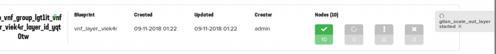

Part IV. Trigger Auto Scale-Out
===============================

1. :ref:`Login to VNF master BIG-IP and Nagios Web UI <login>`
2. :ref:`Run Apache Bench <traffic_run>`
3. :ref:`Watch BIG-IP and Nagios statistics, VNF manager actions <watch>`
4. :ref:`Stop the traffic <traffic_stop>`

.. _login:

Step 1. Login to VNF master BIG-IP and Nagios Web UI
----------------------------------------------------

1. Point Jumphost Browser to a `master` VNF(FW) BIG-IP instance .40 IP address (in Horizon UI :guilabel:`Project` --> :guilabel:`Instances` look for  **vnf_ve_master** VM) and login to BIG-IP TMUI
    a. Navigate to :guilabel:`Statistics` --> :guilabel:`Analytics` --> :guilabel:`CPU`
    b. Watch CPU graph as it crosses pre-defined 40% CPU threshold

2. Open a new tab in the browser and point it to the public floating `https://10.1.20.x/nagios` IP address of Nagios VM. Login using Nagios credentials and navigate to :menuselection:`Services` 
    See :ref:`Credentials <credentials>`

    .. image:: images/nagios.png

.. _traffic_run:

Step 2. Run Apache Bench from traffic_gen VM
--------------------------------------------

1. SSH to `traffic_gen` VM and run `run_traffic.sh` script passing Server IP as an argument:

    .. code-block:: console

        ./run_traffic.sh 10.1.52.101

2. Log files are generated for each thread and are located in the same directory (ab[1-10].out)

.. _watch:

Step 3. Watch BIG-IP and Nagios statistics, VNF manager actions
---------------------------------------------------------------

1. After 2-3 minutes Nagios will show a **CRITICAL** alarm when CPU utilization on VNF layer BIG-IPs reaches pre-defined threshold:

    .. image:: images/alarm.png

    Clicking on the alarm brings up detailed state information

    .. image:: images/alarm_det.png
       
2. Point your browser to the public floating `10.1.20.x` IP address of VNF Manager VM
    a. Login to VNF manager UI and click on :guilabel:`Deployments` from the left-side menuIcon
    b. Watch as VNF manager performs auto scale-out of VNF(FW) instances:

.. _traffic_stop:

Step 4. Stop the traffic
-------------------------

1. Stop the traffic using the following script:

    .. code-block:: console

        ./stop_traffic.sh

What’s Next?

:doc:`Initiate Manual scaleout <man_scaleout>`